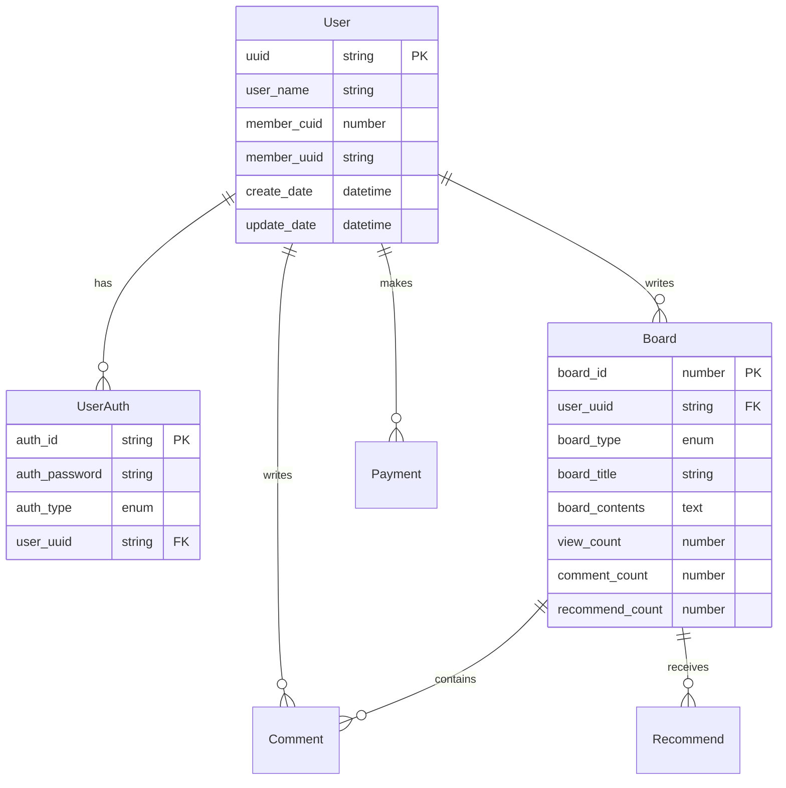

# 🎮 Game Web Renewal Project Backend

> **NestJS 기반의 게임 커뮤니티 백엔드 시스템**  
> 게임 연동, 소셜 로그인, 실시간 검색, 결제 시스템을 포함

<p align="center"></p>
  <p align="center">
  <a href="#"></a>
  <a href="#"></a>
  <a href="#"></a>
  <a href="#"></a>
  <a href="#"></a>
  <a href="#"></a>
  <a href="#"></a>
  <a href="#"></a>
  <a href="#"></a>
</p>

## Description

Game Web Backend Repository.

Seed Project -> https://github.com/LightSirius/T2-backend


this service need elk -> https://github.com/sherifabdlnaby/elastdocker


## Installation

```bash
npm install
```

## Running the app

```bash
# application : development docker
npm run start:docker

# application : development local
npm run start:dev

# application : development pord
npm run start:pord

# db : development redis 
npm run start:redis
```

## Build

```bash
npm run build
```
# Project Info
## Infrastructure architecture


## Sequence diagram


## 🛠️ 기술 스택

### Backend Framework
- **NestJS** - Node.js 기반 백엔드 프레임워크
- **TypeScript** - 정적 타입 검사 및 개발 생산성 향상
- **Express** - 웹 애플리케이션 프레임워크

### Database & Cache
- **PostgreSQL** - 메인 관계형 데이터베이스
- **TypeORM** - ORM 및 데이터베이스 마이그레이션
- **Redis** - 캐싱 및 관리
- **Elasticsearch** - 실시간 검색 및 분석

### Authentication & Security
- **JWT** - 토큰 기반 인증
- **Passport** - 인증 미들웨어
- **bcrypt** - 비밀번호 해싱

### External APIs
- **NHN AppGuard** - 채널링 로그인 연동
- **네이버 OAuth** - SNS 로그인 연동
- **Portone** - 결제 게이트웨이
- **PayPal** - 해외 결제
- **NICE API** - 본인인증 서비스

### DevOps & Tools
- **Docker** - 컨테이너화
- **Docker Compose** - 멀티 컨테이너 오케스트레이션
- **Swagger** - API 문서화
- **ESLint** - 코드 품질 관리
- **Prettier** - 코드 포맷팅

## 📁 프로젝트 구조

```
src/
├── auth/                    # 인증 모듈
│   ├── constants/          # 인증 관련 상수
│   ├── dto/               # 데이터 전송 객체
│   ├── guard/             # 인증 가드
│   ├── strategy/          # Passport 전략
│   ├── auth.controller.ts # 인증 컨트롤러
│   ├── auth.service.ts    # 인증 서비스
│   └── auth.module.ts     # 인증 모듈
├── user/                   # 사용자 모듈
│   ├── services/          # 사용자 관련 서비스
│   ├── constants/         # 사용자 상수
│   ├── exceptions/        # 커스텀 예외
│   ├── interfaces/        # 타입 인터페이스
│   ├── entities/          # 데이터베이스 엔티티
│   ├── dto/              # DTO 클래스
│   ├── user.service.ts   # 사용자 서비스
│   ├── user.controller.ts # 사용자 컨트롤러
│   └── user.module.ts    # 사용자 모듈
├── board/                  # 게시판 모듈
├── comment/               # 댓글 모듈
├── notice/                # 공지사항 모듈
├── payment/               # 결제 모듈
├── game/                  # 게임 연동 모듈
├── nice/                  # 본인인증 모듈
└── utils/                 # 유틸리티 함수
```


## 📊 데이터베이스 설계

### 주요 엔티티 관계도


## 📚 API 문서

### Swagger UI
프로젝트 실행 후 `http://localhost:3000/api-list`에서 상세한 API 문서를 확인할 수 있습니다.

### 주요 API 엔드포인트

#### 인증 API
```http
POST /auth/login/local          # 로컬 로그인
POST /auth/login/sns/naver      # 네이버 SNS 로그인
POST /auth/login/channel/naver  # 네이버 채널 로그인
GET  /auth/login                # JWT 토큰 검증
```

#### 사용자 API
```http
POST /user/registration         # 회원가입
GET  /user/profile             # 프로필 조회
PUT  /user/modify-info         # 정보 수정
PUT  /user/modify-password     # 비밀번호 변경
```

#### 게시판 API
```http
GET  /board/search             # 게시글 검색
POST /board/insert             # 게시글 작성
GET  /board/detail/:id         # 게시글 상세
PUT  /board/modify/:id         # 게시글 수정
```

#### 댓글 API
```http
POST /comment/insert           # 댓글 작성
DELETE /comment/delete         # 댓글 삭제
GET  /comment/list/:board_id   # 댓글 목록
```
